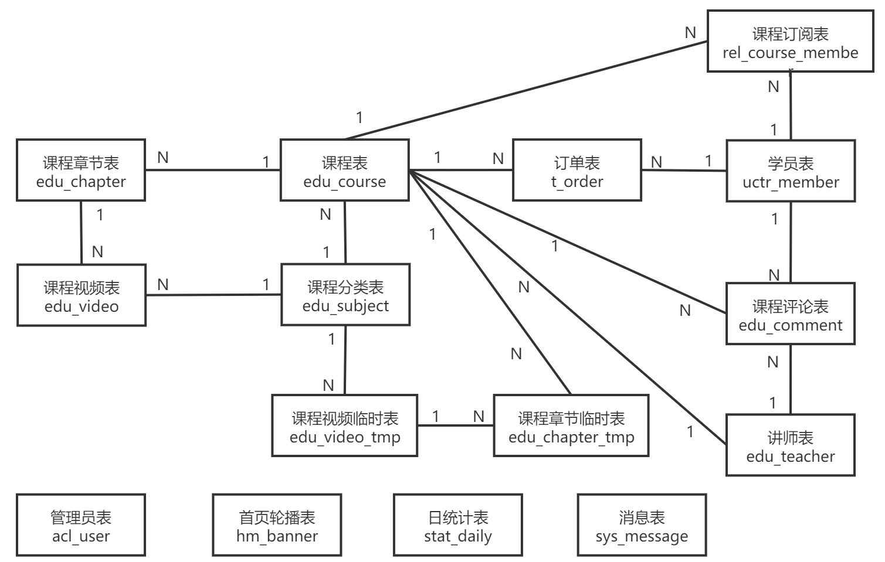
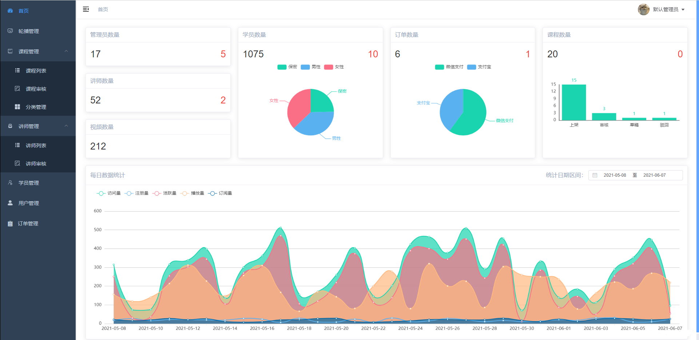

 
基于SpringBoot+Vue前后端分离的在线教育平台项目
  

**赠给有缘人，希望能帮助到你！也请不要吝惜你的大拇指，你的Star、点赞将是对我最大的鼓励与支持！**

**开源传送门：**

- 后台：[Gitee](https://gitee.com/snwjas/online-edu) | [GitHub](https://github.com/snwjas/OnlineEdu)
- 管理员前端：[Gitee](https://gitee.com/snwjas/online-edu-admin) | [GitHub](https://github.com/snwjas/OnlineEdu-Admin)
- 讲师前端：[Gitee](https://gitee.com/snwjas/online-edu-teacher) | [GitHub](https://github.com/snwjas/OnlineEdu-Teacher)
- 学员前端（首页）：[Gitee](https://gitee.com/snwjas/online-edu-app) | [GitHub](https://github.com/snwjas/OnlineEdu-App)

**演示DEMO传送门：**

- 学员端（首页）：[oeapp](https://oeapp.refrain.xyz)
- 管理员端：[oeadmin](https://oeadmin.refrain.xyz)
- 讲师端：[oeteacher](https://oeteacher.refrain.xyz)

## 前言

本项目是笔者毕设作品，肝了一周多时间赶出来的，后台写得比较垃圾，前端界面自我感觉还行，但笔者前端只是打辅助的。总的参考价值因人而言。

- 随心所欲，只为功能实现，没有规范，没有优化，不谈安全；
- Service层没有接口，实现直接返回Controller结果，因而造成代码大量耦合，拓展性极差；
- MyBatis-Plus直接面向对象Dao操作，没有写SQL语句，业务逻辑全部使用JAVA代码完成；
- 仍存在较多缺陷，但显示到的菜单功能基本都是完整的，除了支付功能。

关于项目演示：出于多种考虑，演示DEMO中关于修改的操作全部禁用。如果需要了解完整的项目演示效果，请本地测试运行项目，自行在配置文件配置阿里云OSS和VoD相关选项。

鸣谢：部分界面设计元素参考腾讯课堂与龙果学院。

## 项目介绍

基于SpringBoot+Vue前后端分离的在线教育平台项目，单体应用服务架构。

系统共设计三种角色：管理员、讲师和学员，三个角色分别对应一个操作端。也就是本系统1个后台项目，三个前端项目。管理员端没有引入角色和权限管理，只有一个角色。

已实现的功能列表展示：

**管理员端：**

- 数据统计
- 轮播图管理
- 课程管理
  - 课程列表
  - 课程审核
  - 分类管理
- 讲师管理
  - 讲师列表
  - 讲师审核
- 学员管理
- 用户管理
- 订单管理

**讲师端：**

- 发布课程
- 课程管理
- 评论管理
- 消息接收

**学员端（网站首页）：**

- 登录注册

- 分类与轮播图展示
- 课程列表展示
- 课程搜索（关键词、分类、讲师）
- 课程详情（播放器、课程介绍、评论、讲师简介、订阅）
- 订阅订单
- 讲师入驻

## 技术选型

**开发环境**

- 工具：IntelliJ IDEA
- JDK 1.8
- 数据库：MySQL 8.0.15
- 项目构建：后端Maven、前端 webpack

**后端**

- Web框架：Spring Boot
- 字段校验：Spring Validation
- 持久层：[MyBatis-Plus](https://mybatis.plus/)
- 接口文档：Swagger2
- Lombok：请确保您的 IDE 安装了此插件
- 缓存：Redis
- 工具：[Hutool](https://www.hutool.cn/)
- 资源存储：阿里云对象存储OSS
- 课程视频点播：阿里云视频点播VoD

**前端**

- Vue.js2 全家桶
- Element-UI
- [vue-admin-template](https://github.com/PanJiaChen/vue-admin-template) 后台模板
- axios
- 图表：v-charts（ECharts）
- 富文本编辑器：[wangEditor](https://github.com/wangeditor-team/wangEditor/)
- 等等

## 数据库设计

**数据库: online\_edu，统一编码：utf8mb4**

**表格: acl\_permission**

索引:

| 名称   | 类型 | 属性   | 备注 |
| ------ | ---- | ------ | ---- |
| 主索引 | id   | unique |      |

字段:

| 名称         | 类型                  | 空   | 默认值              | 属性 | 备注                                                         |
| ------------ | --------------------- | ---- | ------------------- | ---- | ------------------------------------------------------------ |
| id           | int\(11\) unsigned    | 否   | \<auto\_increment>  |      | 菜单权限表                                                   |
| pid          | int\(11\) unsigned    | 否   |                     |      | 父级id                                                       |
| type         | tinyint\(4\) unsigned | 否   | 1                   |      | 菜单类型，0顶部菜单、1聚合菜单、2页面菜单、3接口             |
| name         | varchar\(255\)        | 是   |                     |      | 路由名称或接口名称                                           |
| path         | varchar\(255\)        | 否   |                     |      | 菜单路径\(以http开头时，视为打开外部链接\) 或 请求接口的地址 |
| component    | varchar\(255\)        | 是   |                     |      | 菜单组件，只有叶子菜单才可配置                               |
| meta         | varchar\(1023\)       | 是   | \<空>               |      | 菜单的route.meta配置项，json格式                             |
| admin        | tinyint\(1\) unsigned | 否   | 0                   |      | 0默认，1只有超级管理员才能使用                               |
| enable       | tinyint\(1\) unsigned | 否   | 1                   |      | 是否启用，0否1是                                             |
| update\_time | datetime              | 是   | \<INSERT-TimeStamp> |      | 更新时间                                                     |
| create\_time | datetime              | 是   | \<INSERT-TimeStamp> |      | 创建时间                                                     |

**表格: acl\_role**

备注: 角色

索引:

| 名称   | 类型 | 属性   | 备注 |
| ------ | ---- | ------ | ---- |
| 主索引 | id   | unique |      |

字段:

| 名称           | 类型               | 空   | 默认值              | 属性 | 备注               |
| -------------- | ------------------ | ---- | ------------------- | ---- | ------------------ |
| id             | int\(11\) unsigned | 否   | \<auto\_increment>  |      | 角色id             |
| name           | varchar\(31\)      | 否   |                     |      | 角色名称           |
| permission\_id | varchar\(2048\)    | 是   |                     |      | 角色具有的权限ID串 |
| enable         | tinyint\(1\)       | 是   | 1                   |      | 是否启用，0否1是   |
| update\_time   | datetime           | 是   | \<INSERT-TimeStamp> |      | 更新时间           |
| create\_time   | datetime           | 是   | \<INSERT-TimeStamp> |      | 创建时间           |

**表格: acl\_user**

备注: 管理员用户表

索引:

| 名称         | 类型     | 属性   | 备注 |
| ------------ | -------- | ------ | ---- |
| 主索引       | id       | unique |      |
| uk\_username | username | unique |      |

字段:

| 名称         | 类型                  | 空   | 默认值              | 属性 | 备注             |
| ------------ | --------------------- | ---- | ------------------- | ---- | ---------------- |
| id           | int\(11\) unsigned    | 否   | \<auto\_increment>  |      | 用户id           |
| username     | varchar\(31\)         | 否   |                     |      | 用户名           |
| password     | varchar\(255\)        | 否   |                     |      | 密码             |
| nickname     | varchar\(31\)         | 是   |                     |      | 昵称             |
| avatar       | varchar\(1023\)       | 是   |                     |      | 用户头像         |
| mark         | varchar\(255\)        | 是   |                     |      | 备注             |
| sign         | varchar\(255\)        | 是   |                     |      | 用户签名         |
| roleId       | int\(11\) unsigned    | 否   |                     |      | 角色id           |
| enable       | tinyint\(1\) unsigned | 否   | 1                   |      | 是否启用，0否1是 |
| update\_time | datetime              | 是   | \<INSERT-TimeStamp> |      | 更新时间         |
| create\_time | datetime              | 是   | \<INSERT-TimeStamp> |      | 创建时间         |

**表格: edu\_chapter**

备注: 课程章节表

索引:

| 名称   | 类型 | 属性   | 备注 |
| ------ | ---- | ------ | ---- |
| 主索引 | id   | unique |      |

字段:

| 名称         | 类型               | 空   | 默认值              | 属性 | 备注     |
| ------------ | ------------------ | ---- | ------------------- | ---- | -------- |
| id           | int\(11\) unsigned | 否   | \<auto\_increment>  |      | 章节ID   |
| course\_id   | int\(11\) unsigned | 否   |                     |      | 课程ID   |
| title        | varchar\(63\)      | 否   |                     |      | 章节名称 |
| sort         | int\(11\)          | 是   | 0                   |      | 显示排序 |
| update\_time | datetime           | 是   | \<INSERT-TimeStamp> |      | 更新时间 |
| create\_time | datetime           | 是   | \<INSERT-TimeStamp> |      | 创建时间 |

**表格: edu\_chapter\_tmp**

备注: 课程章节临时表（用于存放二次修改的数据）

索引:

| 名称    | 类型 | 属性   | 备注 |
| ------- | ---- | ------ | ---- |
| 主索引  | id   | unique |      |
| idx\_id | oid  |        |      |

字段:

| 名称         | 类型                  | 空   | 默认值              | 属性 | 备注     |
| ------------ | --------------------- | ---- | ------------------- | ---- | -------- |
| id           | bigint\(20\) unsigned | 否   | 0                   |      | 主键     |
| oid          | int\(11\) unsigned    | 是   | 0                   |      | 原章节ID |
| course\_id   | int\(11\) unsigned    | 否   |                     |      | 课程ID   |
| title        | varchar\(63\)         | 否   |                     |      | 章节名称 |
| sort         | int\(11\)             | 是   | 0                   |      | 显示排序 |
| update\_time | datetime              | 是   | \<INSERT-TimeStamp> |      | 更新时间 |
| create\_time | datetime              | 是   | \<INSERT-TimeStamp> |      | 创建时间 |

**表格: edu\_comment**

备注: 课程评论表

索引:

| 名称                        | 类型                   | 属性   | 备注 |
| --------------------------- | ---------------------- | ------ | ---- |
| 主索引                      | id                     | unique |      |
| idx\_course\_id             | course\_id             |        |      |
| idx\_member\_id             | member\_id             |        |      |
| idx\_member\_id\_course\_id | member\_id, course\_id |        |      |
| idx\_teacher\_id            | teacher\_id            |        |      |

字段:

| 名称         | 类型                  | 空   | 默认值              | 属性 | 备注                   |
| ------------ | --------------------- | ---- | ------------------- | ---- | ---------------------- |
| id           | int\(11\) unsigned    | 否   | \<auto\_increment>  |      | 评论ID                 |
| course\_id   | int\(11\) unsigned    | 否   |                     |      | 课程id                 |
| teacher\_id  | int\(11\) unsigned    | 否   |                     |      | 讲师id                 |
| member\_id   | int\(11\) unsigned    | 否   |                     |      | 会员id                 |
| content      | varchar\(1023\)       | 是   |                     |      | 评论内容               |
| mark         | double unsigned       | 是   | 5                   |      | 评分（满分5.00）       |
| status       | tinyint\(1\) unsigned | 是   | \<空>               |      | 评论状态 0审核中 1通过 |
| update\_time | datetime              | 是   | \<INSERT-TimeStamp> |      | 更新时间               |
| create\_time | datetime              | 是   | \<INSERT-TimeStamp> |      | 创建时间               |

**表格: edu\_course**

备注: 课程表

索引:

| 名称   | 类型 | 属性   | 备注 |
| ------ | ---- | ------ | ---- |
| 主索引 | id   | unique |      |

字段:

| 名称         | 类型                    | 空   | 默认值              | 属性                    | 备注                              |
| ------------ | ----------------------- | ---- | ------------------- | ----------------------- | --------------------------------- |
| id           | int\(11\) unsigned      | 否   | \<auto\_increment>  |                         | 课程ID                            |
| teacher\_id  | int\(11\) unsigned      | 否   |                     |                         | 课程讲师ID                        |
| subject\_id  | int\(11\) unsigned      | 否   |                     |                         | 课程科目分类ID                    |
| title        | varchar\(63\)           | 否   |                     |                         | 课程标题                          |
| price        | double\(10,2\) unsigned | 是   | 0.00                |                         | 课程销售价格，设置为0则可免费观看 |
| lesson\_num  | int\(11\) unsigned      | 否   | 0                   |                         | 总课时                            |
| cover        | varchar\(1023\)         | 否   |                     | utf8, utf8\_general\_ci | 课程封面图片路径                  |
| description  | text                    | 是   |                     |                         | 课程描述                          |
| buy\_count   | int\(11\) unsigned      | 是   | 0                   |                         | 销售数量                          |
| view\_count  | int\(11\) unsigned      | 是   | 0                   |                         | 浏览数量                          |
| sort         | int\(11\)               | 是   | 0                   |                         | 显示排序                          |
| enable       | tinyint\(1\)            | 否   | 1                   |                         | 上架下架，0下架 1上架             |
| status       | tinyint\(4\)            | 是   | 0                   |                         | 课程状态，草稿 审核 发表          |
| remarks      | varchar\(511\)          | 是   | \<空>               |                         | 备注                              |
| update\_time | datetime                | 是   | \<INSERT-TimeStamp> |                         | 更新时间                          |
| create\_time | datetime                | 是   | \<INSERT-TimeStamp> |                         | 创建时间                          |

**表格: edu\_subject**

备注: 课程科目分类表

索引:

| 名称            | 类型       | 属性   | 备注 |
| --------------- | ---------- | ------ | ---- |
| 主索引          | id         | unique |      |
| idx\_parent\_id | parent\_id |        |      |

字段:

| 名称         | 类型                  | 空   | 默认值              | 属性 | 备注             |
| ------------ | --------------------- | ---- | ------------------- | ---- | ---------------- |
| id           | int\(11\) unsigned    | 否   | \<auto\_increment>  |      | 课程类别ID       |
| title        | varchar\(15\)         | 否   |                     |      | 类别名称         |
| parent\_id   | int\(11\) unsigned    | 是   | 0                   |      | 父ID             |
| sort         | int\(11\) unsigned    | 是   | 0                   |      | 排序字段         |
| enable       | tinyint\(1\) unsigned | 否   | 1                   |      | 是否启用，0否1是 |
| update\_time | datetime              | 是   | \<INSERT-TimeStamp> |      | 更新时间         |
| create\_time | datetime              | 是   | \<INSERT-TimeStamp> |      | 创建时间         |

**表格: edu\_teacher**

备注: 讲师表

索引:

| 名称       | 类型   | 属性   | 备注 |
| ---------- | ------ | ------ | ---- |
| 主索引     | id     | unique |      |
| uk\_mobile | mobile | unique |      |
| uk\_name   | name   | unique |      |

字段:

| 名称         | 类型                  | 空   | 默认值              | 属性 | 备注                                   |
| ------------ | --------------------- | ---- | ------------------- | ---- | -------------------------------------- |
| id           | int\(11\) unsigned    | 否   | \<auto\_increment>  |      | 讲师ID                                 |
| mobile       | char\(11\)            | 否   |                     |      | 手机号                                 |
| email        | varchar\(127\)        | 是   |                     |      | 邮箱地址                               |
| password     | varchar\(255\)        | 否   |                     |      | 密码                                   |
| name         | varchar\(63\)         | 否   |                     |      | 讲师姓名                               |
| intro        | varchar\(1023\)       | 否   |                     |      | 讲师简介                               |
| avatar       | varchar\(1023\)       | 是   |                     |      | 讲师头像                               |
| resume       | varchar\(1023\)       | 是   |                     |      | 讲师简历链接                           |
| division     | tinyint\(4\)          | 是   | 80                  |      | 分成比例，0-100                        |
| sort         | int\(11\)             | 是   | 0                   |      | 排序                                   |
| enable       | tinyint\(1\) unsigned | 否   | 1                   |      | 是否启用，0否1是                       |
| status       | tinyint\(4\)          | 是   | 0                   |      | 讲师状态：审核通过；审核不通过；待审核 |
| update\_time | datetime              | 是   | \<INSERT-TimeStamp> |      | 更新时间                               |
| create\_time | datetime              | 是   | \<INSERT-TimeStamp> |      | 创建时间                               |

**表格: edu\_video**

备注: 课程视频

索引:

| 名称             | 类型        | 属性   | 备注 |
| ---------------- | ----------- | ------ | ---- |
| 主索引           | id          | unique |      |
| idx\_chapter\_id | chapter\_id |        |      |
| idx\_course\_id  | course\_id  |        |      |

字段:

| 名称         | 类型                  | 空   | 默认值              | 属性 | 备注                      |
| ------------ | --------------------- | ---- | ------------------- | ---- | ------------------------- |
| id           | int\(11\) unsigned    | 否   | \<auto\_increment>  |      | 视频ID                    |
| course\_id   | int\(11\) unsigned    | 否   |                     |      | 课程ID                    |
| chapter\_id  | int\(11\) unsigned    | 否   |                     |      | 章节ID                    |
| title        | varchar\(63\)         | 否   |                     |      | 视频显示名称              |
| video\_id    | varchar\(63\)         | 否   |                     |      | 云端视频资源              |
| sort         | int\(11\)             | 是   | 0                   |      | 排序字段                  |
| play\_count  | int\(11\) unsigned    | 是   | 0                   |      | 播放次数                  |
| free         | tinyint\(1\) unsigned | 是   | 1                   |      | 是否可以试听：0免费 1收费 |
| duration     | varchar\(15\)         | 是   | 0                   |      | 视频时长（秒）            |
| size         | bigint\(20\) unsigned | 否   | 0                   |      | 视频源文件大小（字节）    |
| update\_time | datetime              | 是   | \<INSERT-TimeStamp> |      | 更新时间                  |
| create\_time | datetime              | 是   | \<INSERT-TimeStamp> |      | 创建时间                  |

**表格: edu\_video\_tmp**

备注: 课程视频表（用于存放二次修改的数据）

索引:

| 名称             | 类型        | 属性   | 备注 |
| ---------------- | ----------- | ------ | ---- |
| 主索引           | id          | unique |      |
| idx\_chapter\_id | chapter\_id |        |      |
| idx\_course\_id  | course\_id  |        |      |
| idx\_id          | oid         |        |      |

字段:

| 名称         | 类型                  | 空   | 默认值              | 属性 | 备注                      |
| ------------ | --------------------- | ---- | ------------------- | ---- | ------------------------- |
| id           | bigint\(20\) unsigned | 否   | 0                   |      | 主键\(视频ID\)            |
| oid          | int\(11\) unsigned    | 是   | 0                   |      | 原视频ID                  |
| course\_id   | int\(11\) unsigned    | 否   |                     |      | 课程ID                    |
| chapter\_id  | bigint\(20\) unsigned | 否   |                     |      | 章节ID                    |
| title        | varchar\(63\)         | 否   |                     |      | 视频显示名称              |
| video\_id    | varchar\(63\)         | 否   |                     |      | 云端视频资源              |
| sort         | int\(11\)             | 是   | 0                   |      | 排序字段                  |
| play\_count  | int\(11\) unsigned    | 是   | 0                   |      | 播放次数                  |
| free         | tinyint\(1\) unsigned | 是   | 1                   |      | 是否可以试听：0免费 1收费 |
| duration     | varchar\(15\)         | 是   | 0                   |      | 视频时长（秒）            |
| size         | bigint\(20\) unsigned | 否   | 0                   |      | 视频源文件大小（字节）    |
| update\_time | datetime              | 是   | \<INSERT-TimeStamp> |      | 更新时间                  |
| create\_time | datetime              | 是   | \<INSERT-TimeStamp> |      | 创建时间                  |

**表格: hm\_banner**

备注: 首页banner表

索引:

| 名称   | 类型 | 属性   | 备注 |
| ------ | ---- | ------ | ---- |
| 主索引 | id   | unique |      |

字段:

| 名称         | 类型                  | 空   | 默认值              | 属性 | 备注             |
| ------------ | --------------------- | ---- | ------------------- | ---- | ---------------- |
| id           | int\(11\) unsigned    | 否   | \<auto\_increment>  |      | ID               |
| title        | varchar\(63\)         | 是   |                     |      | 标题             |
| image\_url   | varchar\(1023\)       | 否   |                     |      | 图片地址         |
| link\_url    | varchar\(1023\)       | 是   |                     |      | 链接地址         |
| sort         | int\(11\) unsigned    | 否   | 0                   |      | 排序             |
| enable       | tinyint\(1\) unsigned | 否   | 1                   |      | 是否启用，0否1是 |
| update\_time | datetime              | 是   | \<INSERT-TimeStamp> |      | 更新时间         |
| create\_time | datetime              | 是   | \<INSERT-TimeStamp> |      | 创建时间         |

**表格: rel\_course\_member**

备注: 课程订阅-学员关系表

索引:

| 名称                | 类型                   | 属性   | 备注                               |
| ------------------- | ---------------------- | ------ | ---------------------------------- |
| 主索引              | id                     | unique |                                    |
| idx\_course\_id     | course\_id             | unique |                                    |
| idx\_member\_course | member\_id, course\_id |        | 联合索引\(member\_id, course\_id\) |
| idx\_member\_id     | member\_id             | unique |                                    |

字段:

| 名称         | 类型               | 空   | 默认值              | 属性 | 备注     |
| ------------ | ------------------ | ---- | ------------------- | ---- | -------- |
| id           | int\(10\) unsigned | 否   | \<auto\_increment>  |      | 主键     |
| course\_id   | int\(10\) unsigned | 否   | 0                   |      | 课程Id   |
| member\_id   | int\(10\) unsigned | 否   | 0                   |      | 学员Id   |
| update\_time | datetime           | 是   | \<INSERT-TimeStamp> |      | 更新时间 |
| create\_time | datetime           | 是   | \<INSERT-TimeStamp> |      | 创建时间 |

**表格: stat\_daily**

备注: 网站统计日数据

索引:

| 名称            | 类型 | 属性   | 备注 |
| --------------- | ---- | ------ | ---- |
| 主索引          | id   | unique |      |
| statistics\_day | date |        |      |

字段:

| 名称               | 类型               | 空   | 默认值              | 属性 | 备注       |
| ------------------ | ------------------ | ---- | ------------------- | ---- | ---------- |
| id                 | int\(11\) unsigned | 否   | \<auto\_increment>  |      | 主键       |
| date               | datetime           | 否   |                     |      | 统计日期   |
| visit\_count       | int\(11\) unsigned | 是   | 0                   |      | 访客数量   |
| register\_count    | int\(11\) unsigned | 是   | 0                   |      | 注册人数   |
| login\_count       | int\(11\) unsigned | 是   | 0                   |      | 活跃人数   |
| video\_view\_count | int\(11\) unsigned | 是   | 0                   |      | 视频播放数 |
| course\_buy\_count | int\(11\) unsigned | 是   | 0                   |      | 购买数量   |
| update\_time       | datetime           | 是   | \<INSERT-TimeStamp> |      | 更新时间   |
| create\_time       | datetime           | 是   | \<INSERT-TimeStamp> |      | 创建时间   |

**表格: sys\_message**

备注: 消息表

索引:

| 名称        | 类型   | 属性   | 备注 |
| ----------- | ------ | ------ | ---- |
| 主索引      | id     | unique |      |
| idx\_to\_id | to\_id |        |      |

字段:

| 名称         | 类型                  | 空   | 默认值              | 属性 | 备注                          |
| ------------ | --------------------- | ---- | ------------------- | ---- | ----------------------------- |
| id           | int\(11\) unsigned    | 否   | \<auto\_increment>  |      | 消息id                        |
| from\_id     | int\(11\) unsigned    | 否   | 0                   |      | 发送者Id                      |
| from\_role   | tinyint\(4\)          | 否   | 0                   |      | 发送者角色\(管理员、讲师...\) |
| to\_id       | int\(11\) unsigned    | 否   | 0                   |      | 接受者id                      |
| to\_role     | tinyint\(4\) unsigned | 否   | 0                   |      | 接受者角色\(教师、学员...\)   |
| title        | varchar\(127\)        | 是   |                     |      | 消息标题                      |
| content      | varchar\(511\)        | 否   |                     |      | 消息内容                      |
| has\_read    | tinyint\(1\) unsigned | 是   | 0                   |      | 是否已读\(0未读 1已读\)       |
| update\_time | datetime              | 是   | \<INSERT-TimeStamp> |      | 更新时间                      |
| create\_time | datetime              | 是   | \<INSERT-TimeStamp> |      | 创建时间                      |

**表格: t\_order**

备注: 订单表

索引:

| 名称                        | 类型                   | 属性   | 备注 |
| --------------------------- | ---------------------- | ------ | ---- |
| 主索引                      | id                     | unique |      |
| idx\_course\_id             | course\_id             |        |      |
| idx\_member\_id             | member\_id             |        |      |
| idx\_member\_id\_course\_id | member\_id, course\_id |        |      |
| ux\_order\_no               | order\_no              | unique |      |

字段:

| 名称             | 类型                  | 空   | 默认值              | 属性 | 备注                                   |
| ---------------- | --------------------- | ---- | ------------------- | ---- | -------------------------------------- |
| id               | int\(11\) unsigned    | 否   | \<auto\_increment>  |      |                                        |
| order\_no        | varchar\(18\)         | 否   |                     |      | 订单号\(datetime+unsigned int\)        |
| course\_id       | int\(11\) unsigned    | 否   |                     |      | 课程id                                 |
| member\_id       | int\(11\) unsigned    | 否   |                     |      | 会员id                                 |
| total\_fee       | double\(10,2\)        | 是   | 0.01                |      | 订单金额（分）                         |
| pay\_type        | tinyint\(4\) unsigned | 是   | 0                   |      | 支付类型（0 未支付 1：微信 2：支付宝） |
| transaction\_num | varchar\(31\)         | 是   |                     |      | 交易流水号                             |
| pay\_time        | datetime              | 是   | \<空>               |      | 支付完成时间                           |
| update\_time     | datetime              | 是   | \<INSERT-TimeStamp> |      | 更新时间                               |
| create\_time     | datetime              | 是   | \<INSERT-TimeStamp> |      | 创建时间                               |

**表格: uctr\_member**

备注: 会员表

索引:

| 名称         | 类型     | 属性   | 备注 |
| ------------ | -------- | ------ | ---- |
| 主索引       | id       | unique |      |
| uk\_mobile   | mobile   | unique |      |
| uk\_nickname | nickname | unique |      |

字段:

| 名称         | 类型                  | 空   | 默认值              | 属性 | 备注             |
| ------------ | --------------------- | ---- | ------------------- | ---- | ---------------- |
| id           | int\(11\) unsigned    | 否   | \<auto\_increment>  |      | 会员id           |
| mobile       | char\(11\)            | 否   |                     |      | 手机号           |
| email        | varchar\(127\)        | 是   |                     |      | 邮箱地址         |
| password     | varchar\(255\)        | 否   |                     |      | 密码             |
| nickname     | varchar\(31\)         | 是   |                     |      | 昵称             |
| sex          | tinyint\(4\) unsigned | 是   | 0                   |      | 性别 1 女，2 男  |
| age          | tinyint\(3\) unsigned | 是   | 0                   |      | 年龄             |
| avatar       | varchar\(1023\)       | 是   |                     |      | 用户头像         |
| sign         | varchar\(127\)        | 是   |                     |      | 用户签名         |
| enable       | tinyint\(1\)          | 是   | 1                   |      | 是否启用，0否1是 |
| update\_time | datetime              | 是   | \<INSERT-TimeStamp> |      | 更新时间         |
| create\_time | datetime              | 是   | \<INSERT-TimeStamp> |      | 创建时间         |

## 实现效果

**更多实现效果图请看附件`README.assets`**

管理员端：

讲师端：

学员端：

## 总结与展望

事实说明，毕设工作量完全超出了答辩的正常范围，这点我是没想到的，因为只演示了系统一小部分功能就拿了答辩优秀。最后也是希望本项目可以给到有需要的人一些帮助。谢谢大家。

展望：

- 代码重构，解决前言中的问题。
- 功能完善，完善支付模块、权限管理等功能。
- 架构升级，微服务拆分，引入前沿技术。

当然，这一切的前提是我心情不错且拥有足够的空闲时间。